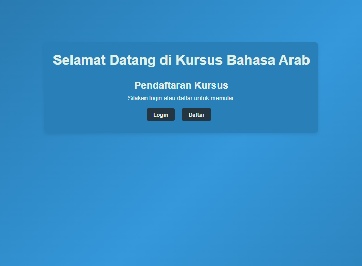
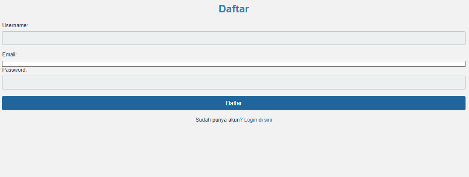
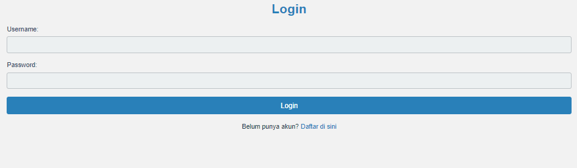
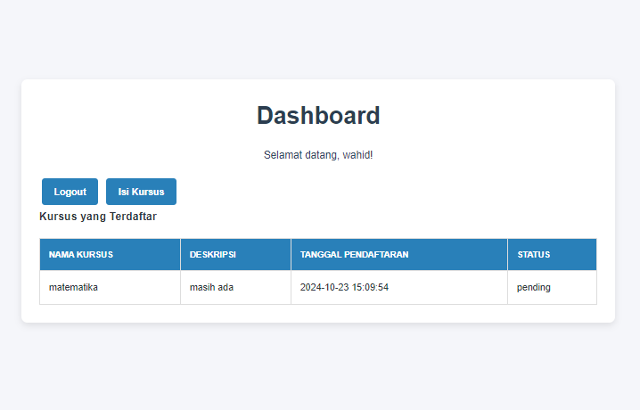

# Aplikasi Pendaftaran Kursus

Aplikasi ini adalah sistem manajemen pendaftaran kursus yang dirancang untuk memudahkan pengguna dalam mendaftar dan mengelola kursus. Aplikasi ini dibangun menggunakan PHP, HTML, dan CSS.

## Struktur Aplikasi

Aplikasi ini terdiri dari beberapa halaman utama:

1. **Halaman Utama** - `index.php`
   - Halaman ini menyajikan informasi tentang aplikasi dan memberikan navigasi ke fitur lainnya.

   

2. **Registrasi** - `register.php`
   - Halaman ini memungkinkan pengguna untuk mendaftar sebagai peserta kursus baru dengan mengisi informasi seperti nama, email, dan kata sandi.
     

3. **Login** - `login.php`
   - Halaman untuk pengguna yang telah terdaftar agar dapat masuk ke akun mereka. Pengguna perlu memasukkan email dan kata sandi yang telah didaftarkan.
 
4. **Dashboard** - `dashboard.php`
   - Halaman yang ditampilkan setelah pengguna berhasil login. Di sini, pengguna dapat melihat kursus yang tersedia dan mengelola pendaftaran mereka.
 
## Cara Menggunakan

1. **Instalasi**
   - Pastikan Anda memiliki server lokal seperti XAMPP atau MAMP terinstal di komputer Anda.
   - Salin folder aplikasi ke direktori `htdocs` (XAMPP) atau `htdocs` (MAMP).

2. **Menjalankan Aplikasi**
   - Buka browser dan navigasikan ke `http://localhost/app/Minggu-1/ahad/hmm/index.php` untuk mengakses aplikasi.

3. **Mendaftar**
   - Klik tautan untuk registrasi dan isi formulir pendaftaran dengan informasi yang diperlukan.

4. **Masuk**
   - Setelah mendaftar, Anda dapat masuk menggunakan halaman login.

5. **Dashboard**
   - Setelah berhasil login, Anda akan diarahkan ke dashboard, di mana Anda dapat melihat dan mengelola pendaftaran kursus.

